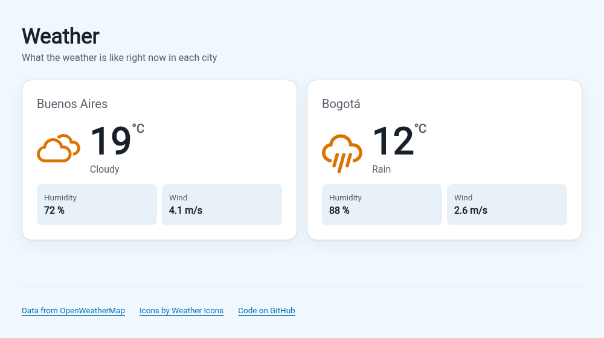

# Weather

**Live demo:** https://diegomottadev.github.io/whetherapp-react/

<picture>
  <source media="(prefers-color-scheme: dark)" srcset="docs/screenshots/dark.png">
  
</picture>

I built this in March and April 2020, while I was learning React. It was my first app that talked to a real API.

It shows the current weather for a few cities, with data from [OpenWeatherMap](https://openweathermap.org/). In 2026 I came back to fix its bugs and close it out (see the changelog).

## What it does

- Shows 1 card per city with the temperature, a short description, humidity and wind.
- Loads every city at the same time. If 1 city fails, the others still show their data.
- Shows a skeleton while a card loads, and an error with a "Try again" button if the request fails.
- Picks the icon from the real weather. Rain gets a rain icon, clouds get clouds.
- Follows your system's light or dark mode. On a phone the cards stack in 1 column.

## Stack

React 16.14 with hooks, built with Vite 8 and tested with Vitest. PropTypes checks the props.

Styles are plain CSS with custom properties and OKLCH colors. The icons come from [Weather Icons](https://erikflowers.github.io/weather-icons/), loaded from a CDN.

## Getting started

You need Node 20.19 or newer and npm. You also need a free OpenWeatherMap API key from https://home.openweathermap.org/api_keys (new keys can take a couple of hours to start working).

```bash
git clone https://github.com/diegomottadev/whetherapp-react.git
cd whetherapp-react
npm install
cp .env.example .env.local
```

Open `.env.local` and paste your key:

```
VITE_OPENWEATHER_KEY=your-key-here
```

Then start the dev server:

```bash
npm run dev
```

It opens on http://localhost:5173. Without a key, every card shows "The API key is missing".

## Scripts

| Command | What it does |
| --- | --- |
| `npm run dev` | Dev server with hot reload (`npm start` does the same) |
| `npm test` | Vitest in watch mode (`npx vitest run` runs once and exits) |
| `npm run lint` | ESLint over the whole project |
| `npm run build` | Production build in `build/` |
| `npm run preview` | Serves the production build locally |
| `npm run deploy` | Builds and publishes to GitHub Pages |

## Deploy

The site lives on GitHub Pages, served from the `gh-pages` branch. To publish a new version, commit your changes and run:

```bash
npm run deploy
```

`scripts/deploy.sh` builds the app, checks out `gh-pages` in a temporary `.gh-pages/` folder with `git worktree`, swaps in the new build and pushes it. Your current branch stays the same.

It stops if you have uncommitted changes. Each deploy commit points to the source commit it came from, like `Deploy c417c29`, so the files on disk have to match that commit.

The build uses `/whetherapp-react/` as its base path (set in `vite.config.mjs`), because Pages serves the repo from that subfolder. The dev server keeps using `/`.

**Your API key ends up in the published site.** Vite puts every `VITE_*` variable inside the JavaScript bundle, so anyone can read it in the browser. Use a free key that you only use for this.

## Project structure

```
src/
├── index.jsx / index.css    # entry point; index.css holds the design tokens
├── api/openWeather.js       # fetchCurrentWeather(query, { signal })
├── constants/               # cities, weather states, request status, footer links
├── types/weather.js         # shared PropTypes
├── utils/                   # pure helpers: API response to UI data, number formatting
└── components/
    ├── App/                 # the only component with state, plus its tests
    ├── WeatherList/  WeatherCard/  CityName/
    ├── WeatherData/  WeatherTemperature/  WeatherExtraData/  WeatherIcon/
    ├── WeatherSkeleton/  ErrorMessage/  EmptyState/  Button/
    └── Footer/  ExternalLink/
```

A few rules I stuck to:

- `App` owns all the state. Every other component gets props and renders.
- Each component lives in its own folder with its `.jsx`, its CSS and an `index.js`, so imports read `import Button from '../Button'`.
- `api/openWeather.js` is the only file that knows OpenWeatherMap's URL format.
- Colors, spacing and type sizes are CSS variables in `src/index.css`. Components only use `var(--...)`, so dark mode is 1 media query.

## Adding a city or a weather type

Both are 1 edit in `src/constants/`.

To add a city, add an entry to `src/constants/cities.js`. The `query` uses OpenWeatherMap's "City,country" format, with a 2-letter country code:

```js
export const CITIES = [
  // ...
  { id: 'lima', name: 'Lima', query: 'Lima,pe' },
];
```

To give a type of weather its own icon, edit `src/constants/weatherStates.js`. `conditions` lists values of `weather[0].main` from the API, and `icon` is a name from Weather Icons without the `wi-` prefix. Say you want drizzle to stop looking like rain: take `'Drizzle'` out of the rain entry and add this one:

```js
export const WEATHER_STATES = [
  { key: 'rain', conditions: ['Rain'], icon: 'rain', label: 'Rain' },
  { key: 'drizzle', conditions: ['Drizzle'], icon: 'sprinkle', label: 'Drizzle' },
  // ...
];
```

The tests pick up new weather states on their own.

## Tests

39 tests with Vitest and React Testing Library 12 (the last version that works with React 16). They run offline: `fetch` is mocked.

```bash
npx vitest run
```

- `utils/*.test.js` and `api/openWeather.test.js` cover the pure functions and the request: the URL goes over HTTPS, the city name gets encoded, a missing key stops the request, and each HTTP error gets a readable message.
- `components/App/App.test.jsx` uses the app like a person would. It waits for the cards, checks that 1 failed city doesn't break the others, clicks "Try again", and unmounts in the middle of a request.

2 of those tests guard bugs from the changelog. I broke each fix on purpose to check that its test fails, and it did.

## Known issues

- React is still on 16.14 and mounts with `ReactDOM.render`. Moving to React 18 or 19 means switching to `createRoot` and Testing Library 13 or newer.
- The API key is public on the live site (see Deploy). There's no backend to hide it.
- The 2020 code had an API key written in the source. That key is revoked, but it's still in the git history.
- The icons load from cdnjs. If that CDN is down, the cards show no icon and nothing warns you.
- ESLint stays on version 9 until `eslint-plugin-react` supports 10.
- The screenshots are taken by hand (headless Chrome with a mocked API). They won't update on their own when the UI changes.

## Changelog

### 2026 revisit

I came back to this project in 2026 to clean it up and close it out.

**The short version** (if you don't write code, this part's for you)

- **It wouldn't even build.** 1 missing quote mark in a 2020 file stopped the whole thing from turning into a website. I put it back.
- **The sun was always out.** It could be pouring in Bogotá and the app still showed a sun, because it never looked at the forecast to pick the icon. Now the icon matches the sky.
- **It could spin forever.** If something went wrong, like a typo in a city name, you got a loading circle that never stopped. Now you get a short message and a button to try again.
- **The API key was out in the open.** The 2020 key was typed right into the code, on a public repo. It's dead now, and new keys live in a local file that stays out of git.
- **It got a lot lighter.** The app downloaded a whole component library just to draw 1 spinning circle. With that gone, the browser downloads about 44 KB instead of 148 KB.
- **The old tools were retired.** The 2020 build tool stopped getting updates years ago and came with 236 known security warnings. The new one has 0 and builds in under a second.
- **It works at night and on your phone.** It follows your dark mode setting, and the cards stack in 1 column on a small screen. You can also use it with just a keyboard or a screen reader.
- **Now there are tests.** 39 small checks run in about 3 seconds and complain if something breaks. Before, there was 1, and it failed.

**The details**

**Bugs fixed**

- The production build failed. A missing quote in `index.html` broke the HTML minifier.
- The icon was always a sun. The function that picked it ignored the API response.
- A failed request left the spinner on forever. The code never checked the HTTP status, so a 404 crashed while reading the response. Errors now show a message and a "Try again" button.
- A request could update a card after it was gone from the page. Requests are now cancelled when a card unmounts or retries.
- The city name went into the URL without encoding, so a name with `&` or `#` broke the request.
- Requests went over `http://`, which browsers block on an HTTPS site like GitHub Pages.
- 2 components had `protoTypes` instead of `propTypes`, so React never checked their props.
- Bogotá used `col` as its country code. OpenWeatherMap expects `co`.

**Structure**

- Each card fetched its own data. Now `App` holds all the state, and the other 13 components only get props.
- The API key, URL and response format moved out of a UI component into `api/openWeather.js`.
- Cities and weather types come from config arrays, so adding one is 1 edit (see above).
- Every file, component and CSS class said "Wheater". It says "Weather" now.
- Dead code is gone: the service worker, the CRA logo and its unused styles, debug `console.log`s.

**UI**

- New design with CSS variables, OKLCH colors, fluid type sizes and dark mode.
- A loading skeleton, and an error state with a "Try again" button. If the city list is empty, the page says so.
- Keyboard focus ring, 44px touch targets, screen reader announcements when a card loads, and reduced motion support.
- The text is in English now. It used to mix English and Spanish.

**Tooling**

- Moved from Create React App and Jest to Vite and Vitest.
- 5 dependencies removed, including `material-ui` (used only for a spinner) and `react-weathericons` (replaced by a 3-line component).
- `npm audit` went from 236 vulnerabilities to 0. All of them came from build and test tools, so the browser bundle was never affected.
- Added ESLint, a deploy script and 39 tests (there was 1 test before, and it failed).

### 2020

- First version, built with Create React App: 2 cities, Material-UI spinner, data from OpenWeatherMap.

## Credits

- Weather data: [OpenWeatherMap](https://openweathermap.org/).
- Icons: [Weather Icons](https://erikflowers.github.io/weather-icons/) by Erik Flowers.
- Font: [Roboto](https://fonts.google.com/specimen/Roboto) from Google Fonts.
